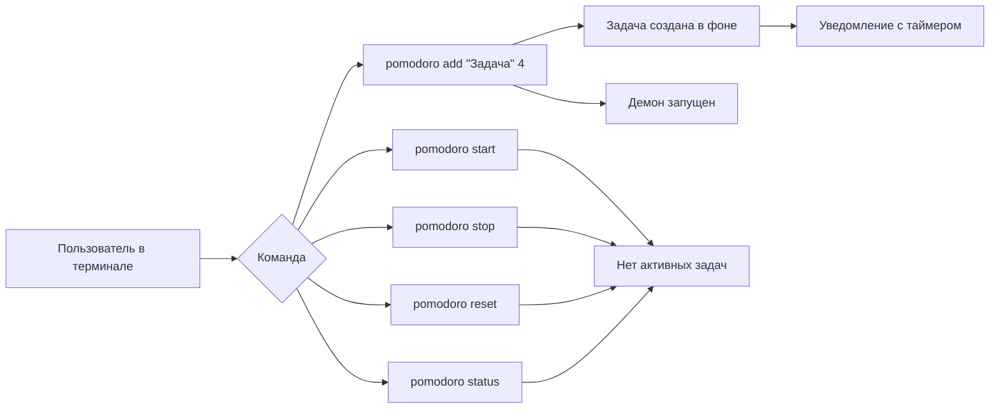
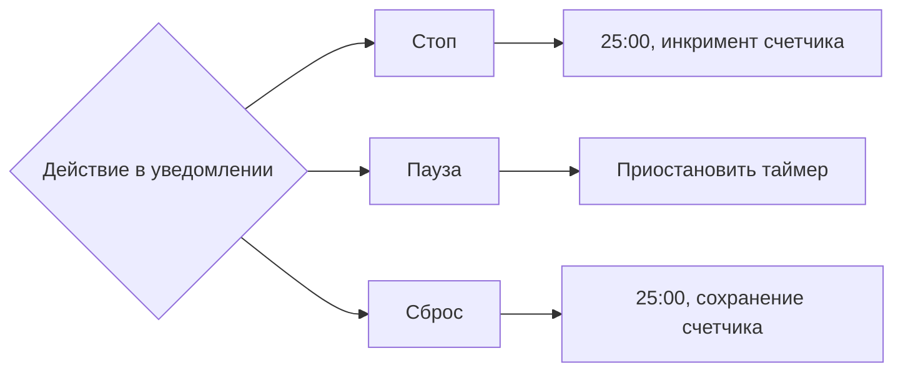
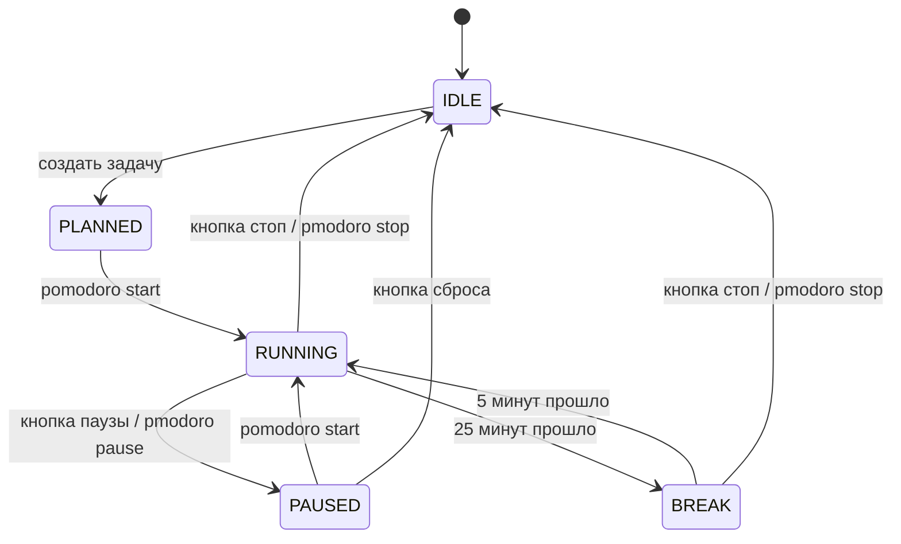
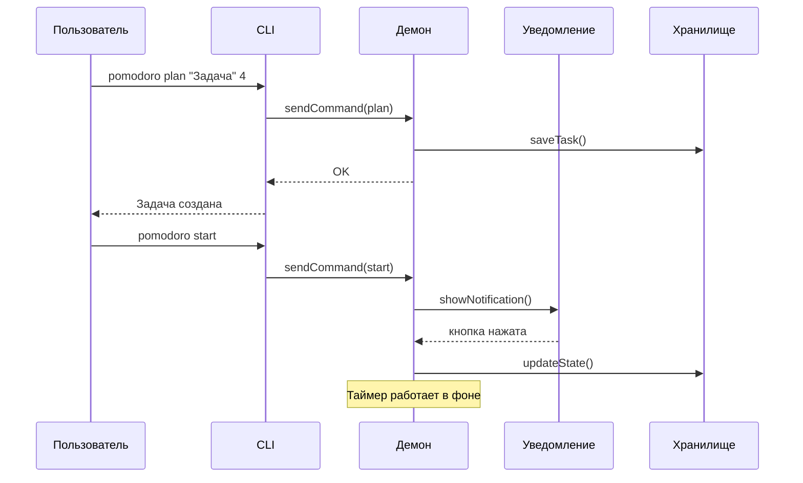
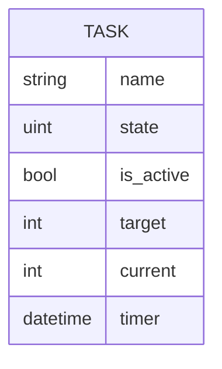

## 🧠 **Алгоритм продумывания приложения**

### 1. **Сбор требований (Requirements Gathering)**

- **Пользовательские истории (User Stories):**
```
US-1: Как пользователь, я хочу создать задачу с N помидорками,
      чтобы спланировать свою работу на день.

US-2: Как пользователь, я хочу запустить таймер,
      чтобы начать работать над задачей.

US-3: Как пользователь, я хочу видеть уведомление с оставшимся временем,
      чтобы не отвлекаться на терминал.

US-4: Как пользователь, я хочу управлять таймером из уведомления,
      чтобы быстро реагировать на изменения.

US-5: Как пользователь, я хочу управлять таймером из терминала,
      как альтернативный поток (если закрыл уведомление).

US-5: Как пользователь, я хочу видеть прогресс (2/4 помидорок),
      чтобы понимать, сколько ещё работать.

US-6: Как пользователь, я хочу иметь только одну активную задачу,
      чтобы фокусироваться на одном деле.

US-7: Как пользователь, я хочу получить звуковое оповещение,
      чтобы не пропустить окончание помидорки.

US-8: Как пользователь, я хочу иметь конфигурацию таймера,
      чтобы настроить свои интервалы работы/отдыха.
```

- **Функциональные требования:**
  ```
  [✓] CLI для создания задачи
  [✓] Фоновая работа (daemon)
  [✓] Уведомления с кнопками
  [✓] Хранение состояния между перезапусками
  [✓] Только одна активная задача
  ```

- **Нефункциональные требования:**
  - Легковесность (<50MB RAM)
  - Старт за <2 секунды
  - Работа без интернета
  - Совместимость с GNOME/KDE

### 2. **User Flow (Пользовательские сценарии)**
**Инструменты:** Whimsical, Draw.io, Excalidraw


**1. Старт приложения**



**2. Управление задачей**



### 3. **Диаграмма состояний (State Machine)**
**Инструменты:** Mermaid (в Markdown), PlantUML



### 4 **Диаграммы последовательности**


### 5. Схема данных



### 6. **Прототипирование API/Интерфейсов**
**Инструменты:** Go скелет с интерфейсами

```go
// Не реализация, а ПРОТОТИП интерфейсов
package main

// Как будет выглядеть "публичный API" демона?
type PomodoroDaemon interface {
    AddTask(name string, pomodoro int) error
    Start() error
    Pause() error
    Stop() error
    Status() Status
}

// Как CLI будет общаться с демоном?
// Вариант 1: Демон слушает Unix socket
// Вариант 2: CLI запускает демон при необходимости

// Как уведомления будут взаимодействовать?
type Action uint

const (
    STOP Action = iota
    PAUSE
    RESET
)

type NotificationManager interface {
    ShowTimer(remaining time.Duration, pomodoros int, actions []string)
    OnAction(action Action) // callback
}
```

### 7. **Выбор технологий с обоснованием**
Таблица сравнения:

| Компонент        | Вариант 1 | Вариант 2                      | Выбор  | Почему              |
| ---------------- | --------- | ------------------------------ | ------ | ------------------- |
| DBus уведомления | `godbus`  | `github.com/esiqveland/notify` | Второй | Выше уровень, проще |
| Хранение         | Pebble    | Badger                         | Pebble | Проще               |
| Конфиг           | YAML      | JSON                           | yaml   | Популярный, удобный |
| CLI фреймворк    | Cobra     | urfave/cli                     | urfave/cli  | Простой          |
|                  |           |                                |        |                     |

### 8. **Сценарии ошибок и edge cases**

```
1. Что если демон уже запущен?
- Проверяем доступность по сокету (реализовать ручку health)
- Проверяем текущие задачи
2. Что если уведомление пропало (пользователь закрыл)?
- Отправлять уведомление повторно при достижении промежуточных состояний (отдых/следующая помидорка, завершение всех помидорок)
3. Что если система засыпает во время таймера?
4. Что если задача уже есть, но пользователь создаёт новую?
- не давать пользователю создавать новую задачу
5. Перезапуск компьютера?
- восстанавливаем состояние
```

**Как должна вести себя каждая из кнопок?**
```
1. Стоп - закончить текущую помидорку
2. Пауза - приостановить таймер
3. Сброс - начать текущую помидорку с самого начала
4. Следующая - Перейкти к следующей помидорке
```

### 9. **Дизайн уведомления (визуально)**
**Инструменты:** Figma, Canva, или просто ASCII

```
[Pomodoro Tracker]
Задача: "Написать документацию"
Таймер: 24:59 ⏱️
Помидорки: 2/4 🍅

[Стоп] [Пауза] [Сброс] [Следующая]
```

### 10. **План поставки (Delivery Plan)**
Поэтапно что будем тестировать:

```
Фаза 0: Proof of Concept
- Таймер в CLI без уведомлений
- Без хранения состояния
- Stdout вывод
- без демона

Фаза 1: MVP
- CLI + уведомления (без кнопок)
- Простое хранение в JSON

Фаза 2: Полная версия
- Кнопки в уведомлениях
- Pebble DB
- Обработка всех edge cases

Фаза 3: Полировка
- Конфигурация
- Статистика
- Темы уведомлений
```

### 11. **Чеклист перед кодом**
```
 [✓] Пользовательские истории записаны
 [✓] User flow нарисован
 [✓] Диаграмма состояний готова
 [✓] API интерфейсы спроектированы
 [✓] Выбраны технологии
 [ ] Edge cases продуманы
 [✓] Визуальный дизайн уведомлений
 [✓] План поставки составлен
```

## 🛠️ **Конкретные инструменты для вас:**

1. **Miro** или **Excalidraw** — для рисования схем
2. **Google Docs** — для требований и user stories  
3. **Mermaid в VS Code** — для диаграмм состояний
4. **Таблица в Notion/Sheets** — для сравнения технологий
5. **Простой Go файл с интерфейсами** — для прототипирования API

**Совет:** Начните с User Flow — нарисуйте на бумаге или в Excalidraw, как пользователь будет взаимодействовать. Это сразу выявит пробелы в логике.

## 📝 Конкретные команды пользователя:


```bash
# Первый запуск (демон запустится автоматически)
$ pomodoro plan "Написать код" 4
✓ Задача запланирована. Демон запущен.

# Проверить статус
$ pomodoro status
Задача: "Написать код"
Таймер: не запущен
Помидорки: 0/4

# Начать работу
$ pomodoro start
✓ Таймер запущен. Смотрите уведомление.

# В уведомлении кнопки:
[Старт] [Пауза] [Стоп] [Сброс]  # Управление из UI

# Остановить задачу
$ pomodoro stop
✓ Задача остановлена. Выполнено: 2/4 помидорок.
```

## Структура проекта

Один модуль, разделение по пакетам

```text
pomodoro/
├── go.mod
├── go.sum
├── main.go                 # Точка входа, роутинг CLI/Daemon
├── internal/               # Внутренние пакеты (не для импорта извне)
│   ├── cli/               # CLI логика
│   │   ├── commands.go    # Обработчики команд
│   │   ├── parser.go      # Парсинг аргументов
│   │   └── client.go      # Клиент для общения с демоном (socket)
│   ├── daemon/            # Демон логика
│   │   ├── server.go      # Socket server
│   │   ├── timer.go       # Таймер
│   │   ├── state_manager.go # Управление состоянием
│   │   └── daemon.go      # Основной цикл демона
│   ├── core/              # Общая бизнес-логика
│   │   ├── models.go      # Структуры Task, Pomodoro, State
│   │   ├── config.go      # Конфигурация
│   │   └── constants.go   # Константы
│   ├── storage/           # Работа с Pebble DB
│   │   ├── store.go       # Интерфейс хранилища
│   │   ├── pebble_store.go # Реализация Pebble
│   │   └── migrations.go  # Миграции схемы
│   ├── notifications/     # Уведомления
│   │   ├── notifier.go    # Интерфейс
│   │   ├── dbus_notifier.go # Реализация через DBus
│   │   └── notification_builder.go # Построитель уведомлений
│   └── ipc/               # Межпроцессное взаимодействие
│       ├── socket.go      # Unix socket клиент/сервер
│       ├── messages.proto # (опционально) Protobuf сообщения
│       └── messages.go    # Генерация сообщений
├── cmd/                   # Альтернатива: точки входа для разных бинарников
│   ├── pomodoro-cli/
│   │   └── main.go        # Только CLI
│   └── pomodoro-daemon/
│       └── main.go        # Только демон
├── scripts/               # Вспомогательные скрипты
│   ├── install.sh         # Установка
│   ├── systemd/           # Systemd юниты
│   │   ├── pomodoro.service
│   │   └── pomodoro.timer
│   └── desktop/           # Desktop файлы
│       └── pomodoro.desktop
├── configs/               # Примеры конфигурации
│   ├── config.toml.example
│   └── default_config.go  # Константы по умолчанию
├── Makefile               # Сборка, тесты, установка
├── .gitignore
└── README.md
```